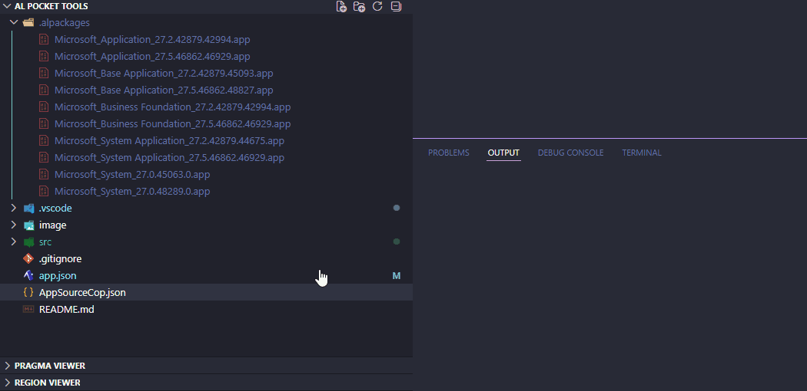
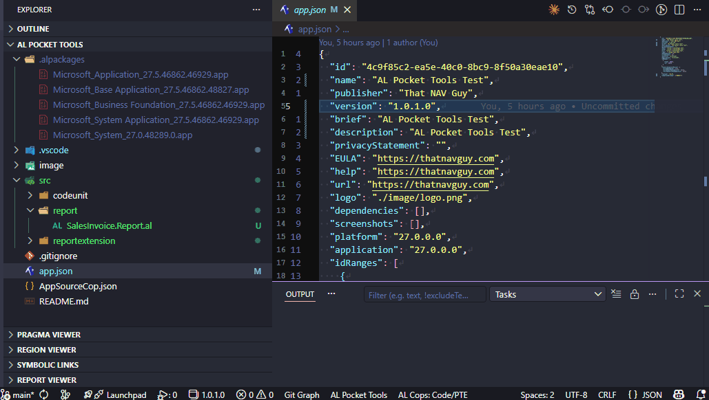
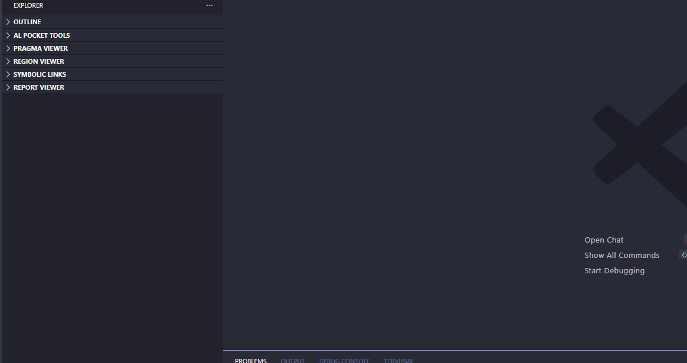
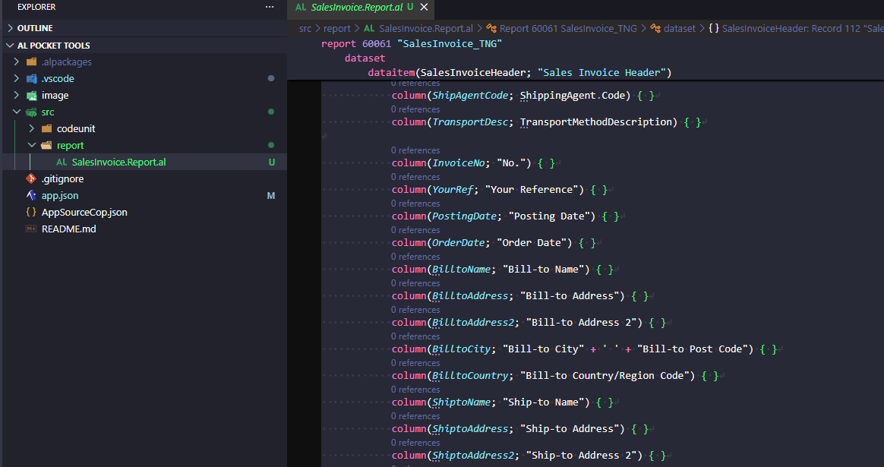

# AL Pocket Tools

A collection of tools for AL (Business Central Application Language) development in VS Code.

- Cleanup Duplicate Apps

- Version Bump

- Pragma Viewer

- Report Viewer

## Features

| Feature | Description |
|---|---|
| [Cleanup Duplicate App Files](docs/features/cleanup-app-files.md) | Scans your repository for duplicate `.app` files and deletes older versions, keeping only the latest of each app. |
| [Region Viewer](docs/features/region-viewer.md) | Shows all `#region` blocks in the active AL file as a navigable tree in the Explorer sidebar. Supports nested regions and live updates as you type. |
| [Pragma Viewer](docs/features/pragma-viewer.md) | Shows all `#if`, `#elseif`, and `#pragma warning` directives across the entire workspace, grouped by symbol or warning code. Click any line to navigate to it. |
| [Version Bump](docs/features/version-bump.md) | Increments the Major, Minor, Build, or Revision segment of `app.json` with a single command, with automatic reset of lower segments. Status bar shows the current version at a glance. |
| [Nuke .alpackages](docs/features/nuke-alpackages.md) | Deletes all `.app` files from every `.alpackages` folder in the workspace to force a clean re-download of dependencies. |
| [Sync .alpackages to Latest](docs/features/sync-alpackages.md) | Finds the newest version of each app across all `.alpackages` folders, removes older copies, and propagates the latest version to any folder that was behind. |
| [Launch Config Manager](docs/features/launch-config-manager.md) | Save AL launch configurations to user settings and paste them into any project's `launch.json` via a right-click context menu. |
| [Procedure Visibility](docs/features/procedure-visibility.md) | Report local / internal / public procedure counts in an AL file, navigate to any procedure, and bulk-change procedures between any visibility — in the current file or across the whole project. |
| [Report Viewer](docs/features/report-viewer.md) | Navigable tree of data items, triggers, request page, rendering layouts, global variables, and procedures in the active AL report file. Loads once on file open; manual refresh only. |
| [Rainbow Indent](docs/features/rainbow-indent.md) | Highlights each indentation level with a distinct rainbow color. Toggle on/off with `Ctrl+Shift+I`. Updates live as you type. |
| [Assignment Tracker](docs/features/assignment-tracker.md) | Finds every place in a file or the whole workspace where a specific AL field is assigned — via `Validate()`, `:=`, or `TransferFields()`. Results appear in a dedicated sidebar with click-to-navigate. |
| [Add SetLoadFields](docs/features/set-load-fields.md) | Analyzes which fields are accessed on a Record variable and inserts (or merges into) a `SetLoadFields` call before the first database retrieval. Goes one level deep into called procedures. |

## Requirements

- VS Code 1.118.0 or later
- A workspace containing AL projects or `.alpackages` folders
