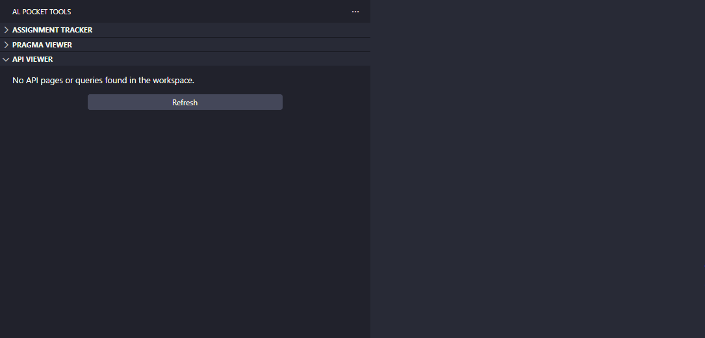

# API Viewer

Scans the whole workspace for AL **API pages** (`PageType = API`) and **API queries** (`QueryType = API`), and shows every exposed entity in a dedicated sidebar. For each entity you can jump to its definition and copy its API path.

## What it does

- Discovers all `page` and `query` objects whose type is `API` across every `.al` file in the workspace (excluding `.git`, `node_modules`, and `.alpackages`).
- Groups entities by **API Publisher / Group / Version**. An object that declares multiple `APIVersion` values appears once under each version.
- For each entity it builds:
  - a **relative path**, e.g. `/api/contoso/sales/v1.0/companies({companyId})/customers`
  - a **full URL** with tenant and environment placeholders, e.g.
    `https://api.businesscentral.dynamics.com/v2.0/{tenantId}/{environment}/api/contoso/sales/v1.0/companies({companyId})/customers`
- If `APIPublisher` is not declared, it is omitted from the path (matching Business Central's routing).

## How to trigger it

- **Sidebar**: open the **AL Pocket Tools** activity bar container and select the **API Viewer** view. The view starts empty — click the Refresh link (or the ↻ button in the title bar) to run the first scan.
- **Refresh**: click the refresh (↻) button in the API Viewer title bar, or run **AL Pocket Tools: Refresh** from the Command Palette while the view is focused, to scan (or re-scan after adding or changing API objects). Refresh is scan-only and never runs automatically; clicking it again while a scan is already in progress is ignored rather than starting a second scan.

## Output / UX flow

- The tree shows group nodes (`publisher/group/version`) each with a count, and entity leaves labelled by `EntitySetName`, with the object type and ID as the description (e.g. `Page 50100`).
- **Click** an entity to open its `.al` file at the object declaration.
- **Hover** an entity to see the entity name, set name, relative path, and full URL.
- **Right-click** an entity (or use the inline icons) for:
  - **Copy Relative Path** — copies the relative API path to the clipboard.
  - **Copy Full URL** — copies the full URL (with `{tenantId}` / `{environment}` / `{companyId}` placeholders) to the clipboard.

## Path conventions / edge cases

- `{companyId}` is always emitted as a placeholder in the `companies(...)` segment; replace it with a real company id at call time.
- `{tenantId}` and `{environment}` in the full URL are placeholders for your Business Central SaaS tenant and environment.
- Entities are keyed off `EntitySetName`; if that property is missing the `EntityName` is used as a fallback in the path.
- Non-API pages and queries (List, Card, etc.) are ignored.
