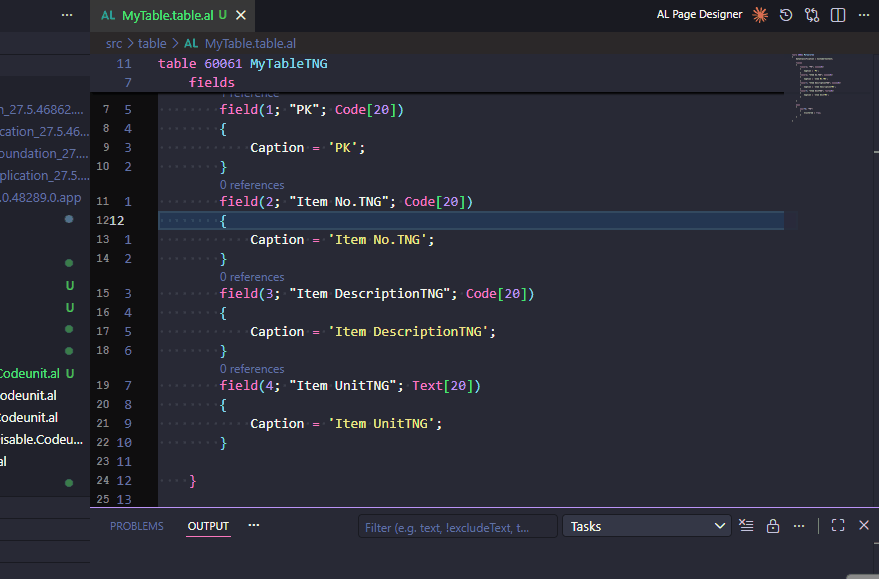

# Caption Affix Removal



Removes a common suffix or prefix from every `Caption` value in the active AL file in a single step.

## Commands

| Command | Trigger |
|---|---|
| `AL Pocket Tools: Remove Caption Suffix...` | Command palette, or right-click an AL file → AL Pocket Tools |
| `AL Pocket Tools: Remove Caption Prefix...` | Command palette, or right-click an AL file → AL Pocket Tools |

## UX flow

1. Open an AL file.
2. Run either command from the command palette or the editor context menu.
3. An input box appears pre-filled with your configured default (see Settings). Edit or confirm the value.
4. The command scans every `Caption = '...'` line in the file and strips the affix wherever it matches.
5. A message reports how many captions were updated. If none matched, a message says so.

## Example

Given:

```al
field(50000; "Item LabelTNG"; Code[20])
{
    Caption = 'Item LabelTNG';
}
field(50001; "Carton LabelTNG"; Code[20])
{
    Caption = 'Carton LabelTNG';
}
```

Running **Remove Caption Suffix** with `TNG` produces:

```al
field(50000; "Item LabelTNG"; Code[20])
{
    Caption = 'Item Label';
}
field(50001; "Carton LabelTNG"; Code[20])
{
    Caption = 'Carton Label';
}
```

Only `Caption` property values are modified — field identifiers and other properties are untouched.

## Settings

| Setting | Default | Description |
|---|---|---|
| `al-pocket-tools.captionAffix.defaultSuffix` | `""` | Pre-fills the input box for Remove Caption Suffix. Leave empty to always prompt without a default. |
| `al-pocket-tools.captionAffix.defaultPrefix` | `""` | Pre-fills the input box for Remove Caption Prefix. Leave empty to always prompt without a default. |

## Edge cases

- **No match**: captions that do not end/start with the entered affix are left unchanged.
- **Empty affix**: entering an empty string is rejected with a validation error before any changes are made.
- **Cancel**: dismissing the input box without confirming makes no changes.
- **Escaped quotes**: `Caption` values containing `''` (AL escaped single quote) are rare in practice for affix removal; only the outer quotes are parsed.
