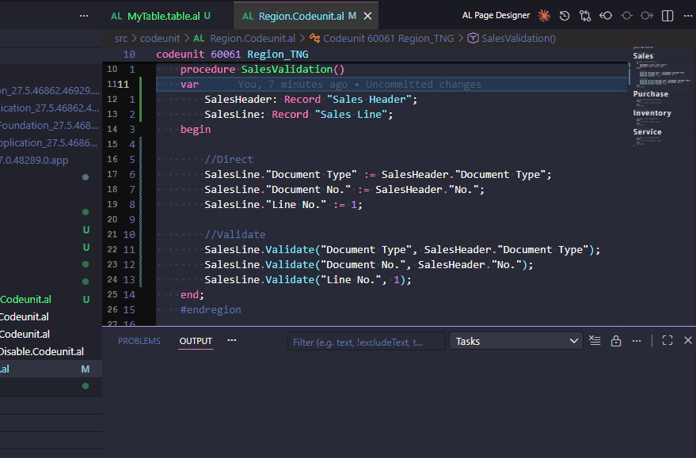

# Convert Assignment to Validate



Converts direct field assignment statements (`:=`) to `.Validate()` calls for a selection of AL code.

## How to trigger

1. Select one or more lines containing field assignments in an AL file.
2. Right-click → **AL Pocket Tools** → **Convert Assignment to Validate**.

Also available via the Command Palette: `AL Pocket Tools: Convert Assignment to Validate`.

## Output / UX flow

Each selected line that matches an assignment pattern is rewritten in place. Lines that do not match (blank lines, comments, non-assignment code) are left unchanged.

A toast notification reports how many lines were converted, e.g. `Converted 3 assignment(s) to Validate.`

## Transformation rules

| Input | Output |
|---|---|
| `Record.Field := Value;` | `Record.Validate(Field, Value);` |
| `Record."Field Name" := Value;` | `Record.Validate("Field Name", Value);` |
| `"Field Name" := Value;` | `Validate("Field Name", Value);` |
| `FieldName := Value;` | `Validate(FieldName, Value);` |

### Example

**Before:**
```al
SalesLine."Document Type" := SalesHeader."Document Type";
SalesLine."Document No." := SalesHeader."No.";
SalesLine."Line No." := 1;
```

**After:**
```al
SalesLine.Validate("Document Type", SalesHeader."Document Type");
SalesLine.Validate("Document No.", SalesHeader."No.");
SalesLine.Validate("Line No.", 1);
```

## Edge cases

- **Non-matching lines** — blank lines, comments, and any line that doesn't parse as an assignment are silently skipped.
- **Bare assignments** (no record prefix) — converted to `Validate(Field, Value)`, for use inside table/page triggers where `Rec` is implicit.
- **Complex values** — expressions like `CalcAmount()`, `Qty * Price`, or string literals containing semicolons are preserved verbatim.
- **Indentation** — leading whitespace is preserved exactly.
- **No selection** — shows a warning: `Select one or more assignment lines first.`
