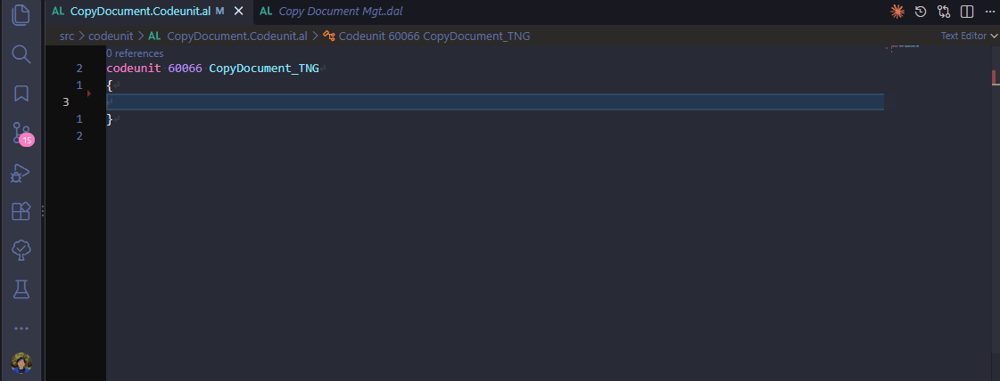

# Convert IntegrationEvent to EventSubscriber



Converts an `[IntegrationEvent(...)]` procedure declaration into a matching `[EventSubscriber(...)]` stub and copies the result to the clipboard, ready to paste into a subscriber codeunit.

## How to trigger

1. Place the cursor inside an `[IntegrationEvent(...)]` procedure declaration, **or** on a line that calls one (e.g. `OnRunTransformationRule(TextValue, RecordRef, Rec);`), in an AL file.
2. Right-click → **AL Pocket Tools** → **Convert IntegrationEvent to EventSubscriber (Copy to Clipboard)**.

Also available via the Command Palette: `AL Pocket Tools: Convert IntegrationEvent to EventSubscriber (Copy to Clipboard)`.

## Output / UX flow

The tool first looks for an `[IntegrationEvent(...)]` attribute at or above the cursor. If the cursor is instead on a call-site line (a bare `ProcedureName(...);` statement), it extracts the called procedure's name and searches the rest of **the same file** for a procedure with that name that has an `[IntegrationEvent(...)]` attribute directly above it. Either way, once the event declaration and its body are found:

1. Determines the enclosing object's type and name by scanning upward for the object declaration line (e.g. `codeunit 50100 Replenishment`).
2. Builds an `[EventSubscriber(ObjectType::<Type>, <Reference>::<ObjectName>, <EventProcedureName>, '', <deprecated>, <deprecatedInfo>)]` attribute, reusing the two boolean arguments from the original `[IntegrationEvent(...)]` attribute. `<Reference>` matches `<Type>` for most object types, except tables and table extensions, which use `Database::<ObjectName>` (e.g. `ObjectType::Table, Database::Item`). The object name is wrapped in double quotes whenever it contains spaces, periods, or other non-identifier characters (e.g. `Codeunit::"Copy Document Mgt."`).
3. Renames the procedure to `<SanitizedObjectName>_<EventProcedureName>`, where `<SanitizedObjectName>` strips any character that isn't valid in an unquoted AL identifier (spaces, periods, etc.) — e.g. `Copy Document Mgt.` becomes `CopyDocumentMgt`. The original parameter list and body are kept untouched.
4. Copies the resulting attribute + procedure declaration + body to the clipboard.
5. Shows a toast notification: `EventSubscriber for '<EventProcedureName>' copied to clipboard.`

Nothing in the source file is modified — paste the clipboard contents into the subscriber codeunit of your choice.

### Example: cursor on the declaration

**Before (selected/cursor inside):**
```al
[IntegrationEvent(false, false)]
local procedure OnBeforePickAccordingToFEFO(Location: Record Location; ItemNo: Code[20]; VariantCode: Code[10]; var Result: Boolean; var IsHandled: Boolean)
begin
end;
```

**Clipboard result:**
```al
[EventSubscriber(ObjectType::Codeunit, Codeunit::Replenishment, OnBeforePickAccordingToFEFO, '', false, false)]
local procedure Replenishment_OnBeforePickAccordingToFEFO(Location: Record Location; ItemNo: Code[20]; VariantCode: Code[10]; var Result: Boolean; var IsHandled: Boolean)
begin
end;
```

### Example: cursor on the call site

**Before (cursor on the call line inside the publishing procedure):**
```al
procedure RunTransformationRule(TextValue: Text; RecordRef: RecordRef; Rec: Variant)
begin
    OnRunTransformationRule(TextValue, RecordRef, Rec);
end;

[IntegrationEvent(false, false)]
local procedure OnRunTransformationRule(TextValue: Text; RecordRef: RecordRef; Rec: Variant)
begin
end;
```

Running the command with the cursor on the `OnRunTransformationRule(TextValue, RecordRef, Rec);` line finds the `[IntegrationEvent(...)]` declaration further down in the same file and copies the same result as if the cursor had been placed directly on the declaration.

## Object type support

The enclosing object type is read from the object declaration line and mapped to its AL `ObjectType` name, e.g. `codeunit` → `Codeunit`, `tableextension` → `TableExtension`, `pageextension` → `PageExtension`, `xmlport` → `XmlPort`, `controladdin` → `ControlAddIn`, etc.

## Edge cases

- **Cursor not on an event or a call to one** — shows a warning: `Place the cursor inside an [IntegrationEvent(...)] procedure declaration, or on a call to one, in this file.`
- **Call site with no matching declaration in the file** — falls through to the same warning above; the lookup does not search other files or the workspace.
- **Call site matches a non-event procedure** — if the called procedure exists but has no `[IntegrationEvent(...)]` attribute directly above it, the lookup keeps searching for other procedures with the same name (rare) and otherwise reports the same warning.
- **No enclosing object found** — shows a warning: `Could not determine the enclosing object type/name for this file.` (e.g. the object declaration line is missing or unrecognized).
- **Multiple events selected** — only the first `[IntegrationEvent(...)]` found at or above the cursor/selection start is converted.
- **Indentation** — the original indentation of the attribute/procedure lines is preserved in the clipboard output.
- **Clipboard only** — the source file is never modified; nothing is inserted automatically.
