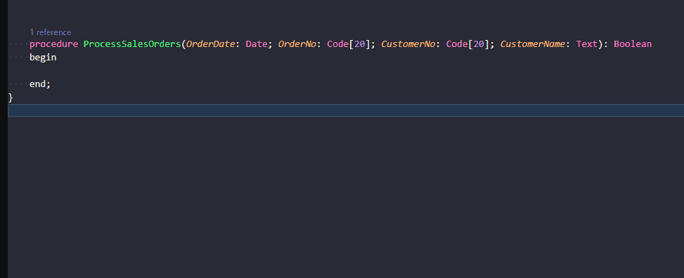

# Parameter Alignment



Toggles procedure declarations between a single-line (horizontal) layout and a vertical layout where each parameter is on its own indented line.

## How to trigger

Place the cursor anywhere on the procedure declaration line (or on a continuation line if the signature is already split across lines), then click the lightbulb (💡) or press `Ctrl+.` to open the code actions menu.

## Actions offered

| Situation | Action shown |
|---|---|
| All parameters on one line | **Expand parameters vertically** |
| Parameters already on separate lines (clean format) | **Collapse parameters to single line** |
| Parameters split across lines but not cleanly formatted | **Normalize parameter alignment** + **Collapse parameters to single line** |

## Output format

**Before (horizontal):**
```al
procedure GetMinimumAllowedPostingDate(SetupRecordID: RecordId; OriginalPostingDate: Date): Date
```

**After — Expand parameters vertically:**
```al
procedure GetMinimumAllowedPostingDate(
    SetupRecordID: RecordId;
    OriginalPostingDate: Date): Date
```

- The opening `(` stays at the end of the first line.
- Each parameter is indented 4 spaces relative to the `procedure` keyword.
- The closing `)` and optional return type are appended to the last parameter line.
- Procedure-level indentation is preserved (nested procedures indent their parameters accordingly).

## Normalization

If the signature is already split across multiple lines but in an inconsistent or misaligned format (e.g. the first parameter on the same line as the procedure keyword, or irregular indentation), the **Normalize parameter alignment** action reformats it to the canonical vertical layout described above.

## Scope

Works on `procedure` and `trigger` declarations, including those with `local`, `internal`, or `protected` visibility modifiers. Does not apply to procedure calls — only declarations.
