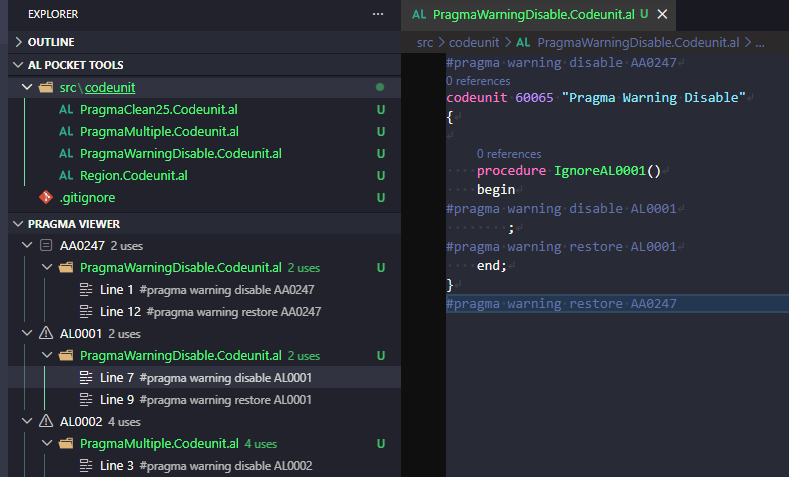

# Pragma Viewer



Shows all pragma directives across the entire AL workspace as a three-level navigable tree. Click any occurrence to jump to it in the editor.

## How to use

Open the **Pragma Viewer** panel in the Explorer sidebar. On first open it scans all AL files in the workspace automatically. Click any line entry to navigate to that pragma in the editor.

Use the **Refresh** button (↺) in the panel header to re-scan the workspace at any time.

## What it does

1. **Scans the workspace** — reads every `.al` file and extracts all pragma directives. Scan runs automatically on first view open.
2. **Groups by identifier** — all occurrences of the same symbol or warning code are collected under one root node, regardless of which files they appear in.
3. **Three-level hierarchy**:
   - **Symbol / Warning code** — the preprocessor symbol name or AL warning code, sorted alphabetically.
   - **File** — AL file that references the identifier (file icon from the active theme).
   - **Line** — the specific line with the full pragma expression as the description.
4. **ON / OFF badge** — if `app.json` declares `preprocessorSymbols`, symbols present in that list show an **ON** badge in green. Warning codes are never ON/OFF — they show a warning icon instead.

## Pragma syntax covered

### Conditional compilation

```al
#if CLEAN19
    // compiled when CLEAN19 is defined
#elseif CLEAN18
    // compiled when CLEAN18 is defined (and CLEAN19 is not)
#else
    // fallback (not tracked — no identifier to group by)
#endif
```

Complex conditions are fully supported. A line like `#if CLEAN18 && !CLEAN19` appears under **both** the `CLEAN18` and `CLEAN19` symbol nodes, each showing the full expression.

### Warning suppression

```al
#pragma warning disable AL0468
    // code that triggers AL0468
#pragma warning restore AL0468
```

Comma-separated codes on a single line (`#pragma warning disable AL0001, AL0468`) each appear as separate entries under their respective warning code nodes.

## ON / OFF detection

The panel reads `app.json` from the workspace root and looks for the `preprocessorSymbols` array:

```json
{
  "preprocessorSymbols": ["CLEAN19"]
}
```

Symbols in that list receive an **ON** badge in green; all others are shown without a badge. Warning codes (`AL####`) are never affected by this setting.

## Tree item display

| Level | Label | Description | Icon |
|---|---|---|---|
| Preprocessor symbol (e.g. `CLEAN19`) | Symbol name | `ON · 4 uses` or `4 uses` | `symbol-constant` (green if ON) |
| Warning code (e.g. `AL0468`) | Warning code | `4 uses` | `warning` |
| File | Filename | `2 uses` | File icon from active theme |
| Line | `Line 17` | Full pragma expression (e.g. `#pragma warning disable AL0468`) | `symbol-keyword` |

## Panel states

| State | What you see |
|---|---|
| View not yet opened | Empty — no scan has run |
| Scanning in progress | Empty tree while async scan completes |
| Pragmas found | Full three-level tree |
| No pragma directives in workspace | Welcome message with Refresh button |
