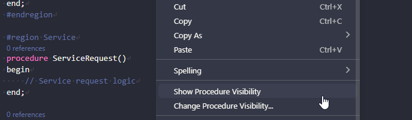

# Procedure Visibility

Inspect and change the visibility of procedures in AL files. See at a glance how many procedures are `local`, `internal`, or `public`, navigate to any of them, and change procedures from any visibility to any other — in the current file or across the entire project.

## How to use

All commands are available from the **editor context menu** (right-click inside an open `.al` file) and from the **Command Palette** (`Ctrl+Shift+P`). The project-wide command is available from the Command Palette only.

---

### Show Procedure Visibility

1. Open any `.al` file in the editor.
2. Right-click and select **AL Pocket Tools: Show Procedure Visibility**.
3. The report is shown in the style configured by `al-pocket-tools.procedureVisibility.reportStyle`.

**List style** (default): A searchable list shows every procedure in the file with its visibility and line number. Selecting a procedure closes the list and jumps the cursor to that line.

**Dialog style**: A simple popup displays only the three counts (Local, Internal, Public).

---

### Change Procedure Visibility (current file)

1. Open an `.al` file in the editor.
2. Right-click and select **AL Pocket Tools: Change Procedure Visibility...**
3. Pick the **source** visibility — only visibilities that have at least one procedure in the file are shown, each with a count.
4. Pick the **target** visibility (the source is excluded from this list).
5. Confirm the change according to the `al-pocket-tools.procedureVisibility.confirmationStyle` setting (see below).
6. All selected procedures are updated in place.

If no procedures of the selected source visibility are found, an info message is shown and no changes are made.

---

### Change Procedure Visibility (Project)

1. Open the Command Palette (`Ctrl+Shift+P`) and run **AL Pocket Tools: Change Procedure Visibility... (Project)**.
2. Pick the **source** visibility.
3. Pick the **target** visibility.
4. A single confirmation dialog shows the total number of procedures and files affected.
5. After confirming, all changes are applied atomically across every AL file in the workspace. Files with no matching procedures are silently skipped.
6. A summary message reports the number of procedures changed and files affected.

> The project-wide command always uses single confirmation regardless of the `confirmationStyle` setting, since per-procedure confirmation across dozens of files would be impractical.

---

## Settings

### `al-pocket-tools.procedureVisibility.reportStyle`

| Value | Behaviour |
|---|---|
| `list` (default) | Searchable list of all procedures with visibility and line number. Select one to navigate. |
| `dialog` | Simple popup showing only the Local / Internal / Public counts. |

### `al-pocket-tools.procedureVisibility.confirmationStyle`

| Value | Behaviour |
|---|---|
| `once` (default) | Single dialog: _"Change N [source] procedures to [target] in [file]?"_ — then all changes apply at once. |
| `perProcedure` | One dialog per procedure: **Yes** / **Yes to All** / **Skip** / **Cancel**. "Cancel" aborts entirely with no changes applied. |

---

## Commands

| Command | Palette title | Where |
|---|---|---|
| `al-pocket-tools.showProcedureVisibility` | AL Pocket Tools: Show Procedure Visibility | Right-click in `.al` file + Palette |
| `al-pocket-tools.changeProcedureVisibility` | AL Pocket Tools: Change Procedure Visibility... | Right-click in `.al` file + Palette |
| `al-pocket-tools.changeProcedureVisibilityProject` | AL Pocket Tools: Change Procedure Visibility... (Project) | Palette only |

## Edge cases

- **Trigger procedures** (`trigger OnRun()`, etc.) are not matched — they start with `trigger`, not `procedure`.
- **Quoted procedure names** (e.g. `procedure "Sales Document - Line"()`) are supported.
- **Commented-out procedures** are not matched because the regex anchors to the start of the line; a line beginning with `//` will not match.
- **No double-pass needed** — the edit is computed from the original content before any change is applied, so all offsets remain valid across a single `WorkspaceEdit`.
- **Project command and unsaved changes** — files open in an editor use the current in-memory content; files not open use the on-disk content.
