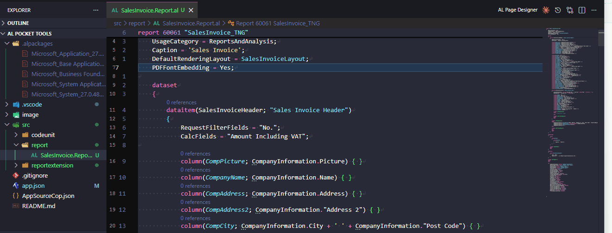

# Rainbow Indent

Highlights each indentation level in the active editor with a distinct background color, making it easy to visually trace nested code blocks at a glance.

## How to trigger

| Method | Action |
|---|---|
| Keyboard shortcut | `Ctrl+Shift+I` (Windows/Linux) / `Cmd+Shift+I` (Mac) |
| Command Palette | **AL Pocket Tools: Toggle Rainbow Indent** |

## Changing the keybinding

1. Open **File → Preferences → Keyboard Shortcuts** (or press `Ctrl+K Ctrl+S`)
2. Search for **Toggle Rainbow Indent**
3. Click the pencil icon next to the command and press your preferred key combination

## Dismiss behaviour

Rainbow indent always dismisses automatically the moment you type anything. Pressing `Ctrl+Shift+I` again before typing will also dismiss it manually.

What happens when you **switch editor tabs** is controlled by the **`al-pocket-tools.rainbowIndent.onEditorSwitch`** setting:

| Value | Behaviour |
|---|---|
| `autoHide` *(default)* | Rainbow indent is dismissed when you switch to a different editor tab. |
| `follow` | Rainbow indent clears from the current tab and re-applies on the new one. |

## Colors

Six semi-transparent colors cycle across indent levels, tuned for dark themes:

| Level | Color |
|---|---|
| 1 | Teal |
| 2 | Green |
| 3 | Amber |
| 4 | Pink-red |
| 5 | Blue |
| 6 | Purple |

Levels beyond 6 wrap back to teal.

## Indent detection

Reads VS Code's `editor.tabSize` and `editor.insertSpaces` settings for the active file. Space-indented files use `tabSize` to determine the column width per level; tab-indented files treat each tab character as one level.

## Edge cases

- Empty or whitespace-only lines are skipped — they produce no decoration.
- The highlight resets when VS Code is restarted.
- Only the active editor is highlighted; other open tabs are unaffected.
