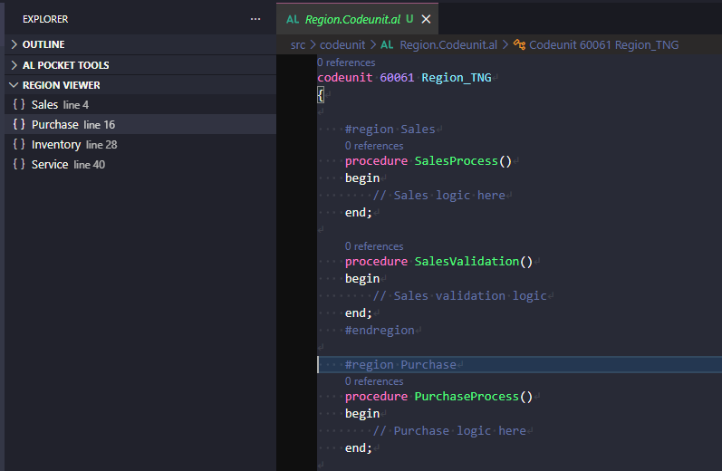

# Region Viewer



Shows all `#region` blocks in the active AL file as a navigable tree in the Explorer sidebar. Click any region to jump to it in the editor.

## How to use

Open any `.al` file. The **Region Viewer** panel in the Explorer sidebar automatically populates with the file's regions. Click a region name to navigate to its `#region` line.

The panel is always visible in the Explorer. When no AL file is active, it shows:
> *Open an AL file to see its regions.*

## What it does

1. **Parses the active file** — extracts all `#region ... #endregion` blocks from the open AL document.
2. **Builds a hierarchy** — nested regions appear as expandable children under their parent.
3. **Updates live** — the tree refreshes automatically when you switch files or edit the current file (debounced 300 ms so it doesn't fire on every keystroke).
4. **Navigates on click** — clicking a region moves the cursor to the `#region` line and centers the editor on it.

## Region syntax

```al
#region MyRegion
    // ... code ...
    #region Nested
        // ...
    #endregion Nested
#endregion MyRegion
```

The viewer matches `#endregion` positionally (like VS Code's built-in folding), so mismatched names in the `#endregion` comment don't affect the tree. Unclosed regions (no matching `#endregion`) are still shown.

## Tree item display

Each item shows:
- **Label** — the region name (text after `#region`)
- **Description** — the 1-based line number (e.g. `line 14`)
- **Icon** — `symbol-namespace` (the namespace icon from VS Code's Codicons)
- **Collapse All** button in the view header collapses all expanded nodes

## Panel states

| State | What you see |
|---|---|
| AL file with regions | Tree of all regions, nested where applicable |
| AL file with no regions | Empty tree |
| No AL file active | "Open an AL file to see its regions." |
| Nested regions | Parent expanded by default; collapsible |
| Unclosed `#region` | Region shown at root level with any children it collected |
