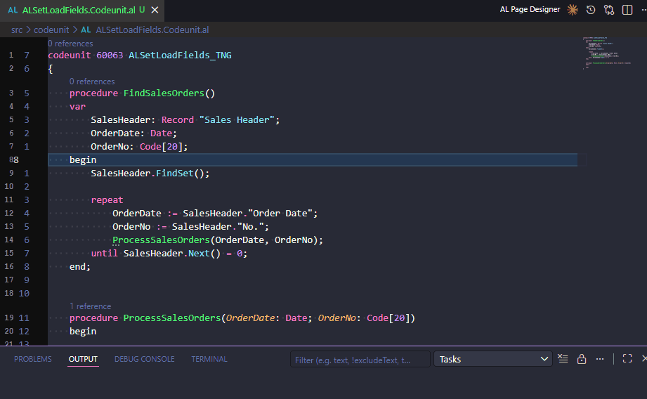

# Add SetLoadFields



## What it does

Analyzes which fields are accessed on a Record variable within the current procedure (and one level deep into called procedures), then automatically inserts or merges a `SetLoadFields` call before the first database retrieval (`Get`, `FindFirst`, `FindSet`, `FindLast`, `Find`).

This improves query performance by ensuring only the fields actually used are loaded from the database.

## How to trigger

1. **Right-click context menu** → **AL Pocket Tools** → **Add SetLoadFields**
2. **Command palette** → `AL Pocket Tools: Add SetLoadFields`

The command is only available in `.al` files.

## Behavior

### Record variable detection

- If the cursor is on a line that references a Record variable, that variable is used automatically.
- If the cursor is not on a recognizable Record variable, a quick pick list of all Record variables in the current procedure is shown.
- If there is only one Record variable in the procedure, it is selected automatically.

### Field collection

The command collects fields from:

1. **Direct field accesses** — e.g. `SalesHeader."Document Type"`, `SalesHeader.Status`
2. **Method parameters** — fields passed to `Validate()`, `TestField()`, `CalcFields()`, `CalcSums()`
3. **Called procedures (one level deep)** — if the record variable is passed to another procedure in the same file (whether by `var` or by value), the fields accessed inside that procedure are also included.

Fields used in `SetRange` / `SetFilter` / `SetCurrentKey` are **not** included because the platform loads filter fields automatically.

### Insertion logic

- If **no `SetLoadFields` exists** for the variable: a new line is inserted immediately before the first `Get`/`Find*` call on that variable.
- If a **`SetLoadFields` already exists**: new fields are merged into the existing call (duplicates are skipped).
- If **no retrieval call** (`Get`/`Find*`) is found: the generated `SetLoadFields` statement is copied to the clipboard with a warning message.

### ReadIsolation

By default the command also inserts a `ReadIsolation` assignment on the line immediately after `SetLoadFields`:

```al
LabelSelection.SetLoadFields("Label Template Code", "Type");
LabelSelection.ReadIsolation := IsolationLevel::ReadUncommitted;
```

If a `ReadIsolation` assignment already exists for the variable in the procedure, no second one is added.

Control this via **Settings → AL Pocket Tools: Set Load Fields: Read Isolation** (`al-pocket-tools.setLoadFields.readIsolation`):

| Value | Behaviour |
|---|---|
| `None` | No `ReadIsolation` line is inserted |
| `ReadUncommitted` *(default)* | Best performance for read-only lookups — no shared locks |
| `ReadCommitted` | Avoids dirty reads |
| `RepeatableRead` | Prevents non-repeatable reads within a transaction |
| `UpdLock` | Acquires an update lock on rows read — prevents deadlocks before a subsequent write |

### One-level-deep analysis

When the record is passed to another procedure in the same file:

```al
procedure ProcessDocument(var SalesHeader: Record "Sales Header")
begin
    SalesHeader.SetLoadFields("Document Type", "No.", "Sell-to Customer No.");
    case SalesHeader."Document Type" of
        SalesHeader."Document Type"::Order:
            ProcessOrder(SalesHeader);
        SalesHeader."Document Type"::Invoice:
            ProcessInvoice(SalesHeader);
    end;
end;
```

The command will also inspect `ProcessOrder` and `ProcessInvoice` for any field accesses on the matching Record parameter, and include those fields in the `SetLoadFields` call.

## Output

- An information message showing how many fields were added and, if applicable, which called procedures contributed fields.
- The `SetLoadFields` line is inserted directly into the editor (or merged into the existing one).

## Edge cases

- Multi-line `SetLoadFields` calls are detected and merged correctly.
- Unquoted field names that clash with Record method names are excluded from results.
- If a called procedure's parameter at the matching position has a different table name, it is skipped.
