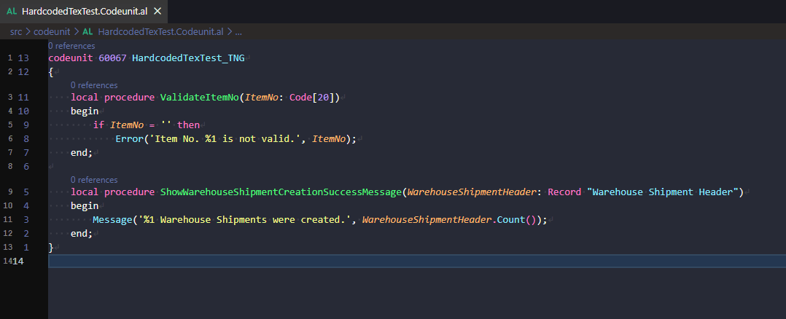

# Convert Hardcoded Text to Label



Converts a selected hardcoded `Error(...)`, `Message(...)`, `Confirm(...)`, or `StrSubstNo(...)` call into a `Label` variable declared in the enclosing procedure's `var` section, following the standard AL labeling convention.

## How to trigger

1. Select one call, e.g. `Error('Item No. %1 is not valid.', ItemNo)`, **or** select multiple lines/procedures spanning several calls (see [Multi-line selections](#multi-line-selections) below).
2. Open the Command Palette and run `AL Pocket Tools: Convert Hardcoded Text to Label`.

Also available via the editor context menu: right-click → **AL Pocket Tools** → **Convert Hardcoded Text to Label** (only shown when there is an active selection).

## Output / UX flow

1. The selected call is parsed: the function name, the string literal message, and any additional arguments.
2. A label name is auto-generated from the message text (placeholders and stopwords like "is", "a", "the" are stripped) and suffixed according to the function used:

   | Function | Suffix | Example |
   |---|---|---|
   | `Error` | `Err` | `Item No. %1 is not valid.` → `ItemNoNotValidErr` |
   | `Message` | `Msg` | `%1 Warehouse Shipments were created.` → `WarehouseShipmentsCreatedMsg` |
   | `Confirm` | `Qst` | `Do you want to post?` → `DoYouWantToPostQst` |
   | `StrSubstNo` | `Lbl` | `%1 %2` → `Lbl` (fallback name if no meaningful words remain) |

3. The enclosing procedure or trigger is located, and:
   - If a `var` section already exists, the new `Label` declaration is appended as the last variable.
   - If no `var` section exists, one is created directly above `begin`.
4. If any `%1`, `%2`, ... placeholders are present, a `Comment` property is generated mapping each placeholder to its argument expression, e.g. `Comment = '%1 = Warehouse Shipment count.'`.
5. The original call is replaced with `<Function>(<LabelName>, <args>...)`.
6. A toast notification confirms the result, e.g. `Converted to label 'ItemNoNotValidErr'.`

### Examples

**Error:**
```al
// Before
if ItemNo = '' then
  Error('Item No. %1 is not valid.', ItemNo);

// After
var
    ItemNoNotValidErr: Label 'Item No. %1 is not valid.', Comment = '%1 = ItemNo.';
begin
    if ItemNo = '' then
      Error(ItemNoNotValidErr, ItemNo);
```

**Message:**
```al
// Before
Message('%1 Warehouse Shipments were created.', TempWarehouseShipmentHeader.Count());

// After
var
    WarehouseShipmentsCreatedMsg: Label '%1 Warehouse Shipments were created.', Comment = '%1 = TempWarehouseShipmentHeader.Count().';
begin
    Message(WarehouseShipmentsCreatedMsg, TempWarehouseShipmentHeader.Count());
```

## Multi-line selections

You can select multiple lines — spanning one or several procedures — and every matching call found in the selection is converted in a single run. Each call is scanned as its own trimmed line; lines that aren't a complete `Error/Message/Confirm/StrSubstNo(...)` call (e.g. `if`, `begin`, `end;`) are **skipped silently**. Each match gets its own enclosing procedure lookup, so calls in different procedures are handled independently, each getting its own `var` section/declaration.

**Before:**
```al
local procedure ValidateItemNo(ItemNo: Code[20])
begin
    if ItemNo = '' then
        Error('Item No. %1 is not valid.', ItemNo);
end;

local procedure ShowWarehouseShipmentCreationSuccessMessage(WarehouseShipmentHeader: Record "Warehouse Shipment Header")
begin
    Message('%1 Warehouse Shipments were created.', WarehouseShipmentHeader.Count());
end;
```

**After** (select from the first `local procedure` line through the last `end;`):
```al
local procedure ValidateItemNo(ItemNo: Code[20])
var
    ItemNoNotValidErr: Label 'Item No. %1 is not valid.', Comment = '%1 = ItemNo.';
begin
    if ItemNo = '' then
        Error(ItemNoNotValidErr, ItemNo);
end;

local procedure ShowWarehouseShipmentCreationSuccessMessage(WarehouseShipmentHeader: Record "Warehouse Shipment Header")
var
    WarehouseShipmentsCreatedMsg: Label '%1 Warehouse Shipments were created.', Comment = '%1 = WarehouseShipmentHeader.Count().';
begin
    Message(WarehouseShipmentsCreatedMsg, WarehouseShipmentHeader.Count());
end;
```

A summary notification reports the outcome, e.g. `Converted 2 call(s) to label(s) (2 new).`

## Edge cases

- **No selection** — shows a warning: `Select an Error(...), Message(...), Confirm(...), or StrSubstNo(...) call first.`
- **Invalid selection** — if the selection isn't a valid call with a string literal message (e.g. it already uses a label, or is malformed), the command shows an error and makes no changes.
- **No enclosing procedure/trigger found** — shows an error and makes no changes.
- **Duplicate message text** — if a `Label` with the exact same message text already exists in the enclosing procedure's `var` section, that label is reused instead of creating a duplicate.
- **Name collisions** — if the auto-generated label name is already used by a different variable in the same procedure, a numeric suffix is appended (e.g. `ItemNoNotValidErr2`).
- **Multiple placeholders** — `Comment` lists every `%N` placeholder that has a matching argument, in ascending order, comma-separated.
- **No placeholders/arguments** — the `Comment` property is omitted entirely.
- **`StrSubstNo` as an expression** — since `StrSubstNo(...)` is typically embedded in a larger statement (e.g. an assignment), select only the `StrSubstNo(...)` call itself, not the surrounding statement.
- **Multi-line selection with no matching calls** — shows a warning: `No Error/Message/Confirm/StrSubstNo(...) calls found in the selection.`
- **Multi-line calls within a multi-line selection** — only calls that appear complete on a single trimmed line are detected; a call whose arguments wrap across multiple lines is not matched when part of a multi-line selection (select it alone instead).
